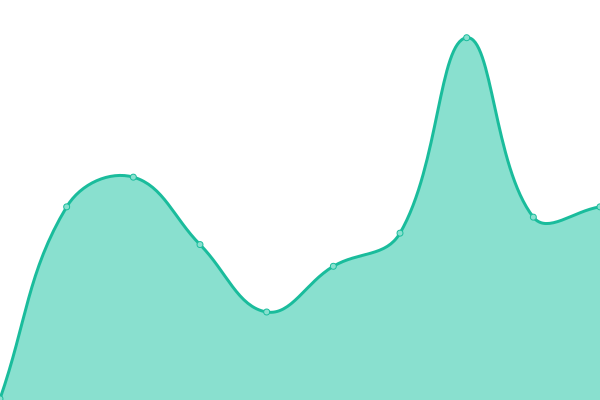
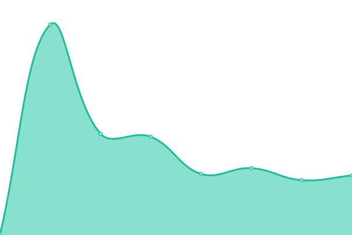

#  [نحاسيات الشهباء — حالة الخدمات](https://status.alshhbaa.com)

> Powered by [Upptime](https://github.com/upptime/upptime) — 100% free, open-source uptime monitoring

This repository contains the status page for [Nhasiat Al-Shhbaa](https://alshhbaa.com), automatically monitoring our services every 5 minutes using GitHub Actions.

## Monitored Services

| Service            | URL                   |
| :----------------- | :-------------------- |
| الموقع الرئيسي     | https://alshhbaa.com  |
| محرك الرسائل (API) | https://formsubmit.co |

<!--start: status pages-->
<!-- This summary is generated by Upptime (https://github.com/upptime/upptime) -->
<!-- Do not edit this manually, your changes will be overwritten -->
<!-- prettier-ignore -->
| URL | Status | History | Response Time | Uptime |
| --- | ------ | ------- | ------------- | ------ |
|  [Website](https://alshhbaa.com) | يعمل | [website.yml](https://github.com/Alshhbaa/status/commits/HEAD/history/website.yml) | 

 125مللي ثانية
     
 | 

<a href="https://status.alshhbaa.com/history/website">100.00%</a>
    

|  [API](https://formsubmit.co/alshhbaa.r@gmail.com) | يعمل | [api.yml](https://github.com/Alshhbaa/status/commits/HEAD/history/api.yml) | 

 88مللي ثانية
     
 | 

<a href="https://status.alshhbaa.com/history/api">100.00%</a>
    

<!--end: status pages-->

## How it works

- **Monitoring**: GitHub Actions runs every 5 minutes to check endpoint health
- **Incidents**: Automatically creates GitHub Issues when downtime is detected
- **Status page**: Auto-generated at [status.alshhbaa.com](https://status.alshhbaa.com) via GitHub Pages
- **Response time**: Daily response time measurements with SVG graphs

## Configuration

Edit [`.upptimerc.yml`](.upptimerc.yml) to add/remove monitored services or customize branding.

## License

- Code: [MIT](./LICENSE)
- Data in `./history` directory: [Open Database License](https://opendatacommons.org/licenses/odbl/1-0/)
